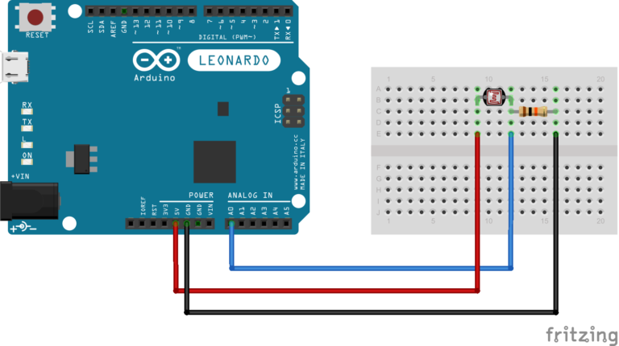
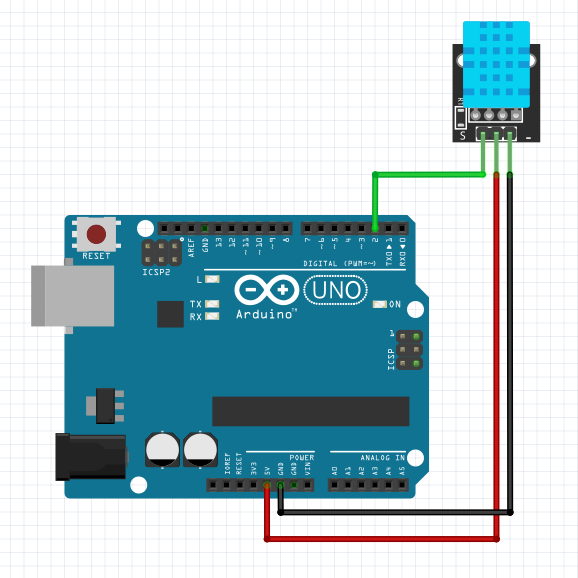

**Travail Pratique : Git et Arduino**

### Objectifs
1. Apprendre les bases de Git : configuration, commandes principales, et collaboration sur un projet.
2. Intégrer des capteurs Arduino (capteur de lumière et capteur DHT11).

---

## Partie 1 : Configuration de Git et gestion de projet

### Prérequis
- Un ordinateur avec Git installé 
- Un compte GitHub 

### Instructions

#### 1. Création d'un compte GitHub
1. Rendez-vous sur [https://github.com/](https://github.com/).
2. Cliquez sur **Sign up** et suivez les instructions pour créer un compte.
3. Notez vos identifiants (nom d'utilisateur et mot de passe).

#### 2. Configuration de Git sur votre machine
1. Ouvrez un terminal.
2. Configurez votre identité Git :
   ```bash
   git config --global user.name "VotreNom"
   git config --global user.email "VotreEmail@example.com"
   ```
3. Vérifiez la configuration :
   ```bash
   git config --list
   ```
#### 3. Authentification avec GitHub
1. Générez une clé SSH :
   ```bash
   ssh-keygen -t ed25519 -C "VotreEmail@example.com"
   ```
2. Ajoutez la clé SSH à votre agent SSH :
   ```bash
   eval "$(ssh-agent -s)"
   ssh-add ~/.ssh/id_ed25519
   ```
3. Copiez la clé SSH :
   ```bash
   cat ~/.ssh/id_ed25519.pub
   ```
4. Ajoutez la clé à GitHub ([Instructions](https://docs.github.com/en/authentication/connecting-to-github-with-ssh)).

#### 3. Clonage du projet
1. Clonez le dépôt :
   ```bash
   git clone https://github.com/MomoDamine/arduino.git
   ```
2. Naviguez dans le répertoire cloné :
   ```bash
   cd arduino
   ```

#### 4. Création d'une nouvelle branche
1. Créez une branche en suivant ce format : `feature/sensorName-prenom1-prenom2`.
   Exemple :
   ```bash
   git checkout -b feature/lightSensor-john-doe
   ```

#### 5. Push de la branche à distance
1. Poussez votre branche sur le dépôt distant :
   ```bash
   git push -u origin feature/lightSensor-john-doe
   ```

#### 6. Faire un commit
1. Modifiez un fichier ou créez-en un nouveau.
2. Ajoutez les modifications à l'index :
   ```bash
   git add nom_du_fichier
   ```
3. Faites un commit :
   ```bash
   git commit -m "Ajout du fichier pour le capteur de lumière"
   ```
4. Poussez les modifications :
   ```bash
   git push
   ```

---

## Partie 2 : Intégration de capteurs Arduino

### Prérequis
- Un kit Arduino avec un capteur de lumière et un capteur DHT11.
- Logiciel Arduino IDE 

### Instructions

#### 1. Intégration du capteur de lumière
1. Connectez le capteur de lumière à l'Arduino :
   - VCC : 5V
   - GND : GND
   - Signal : A0 (Entrée analogique)
2. Développez le code Arduino pour lire les données du capteur de lumière :
   
   

#### 2. Intégration du capteur DHT11
1. Connectez le capteur DHT11 à l'Arduino :
   - VCC : 5V
   - GND : GND
   - Signal : D2 (Entrée digitale)

2. Installez la bibliothèque DHT :
   - Dans l'IDE Arduino, allez dans **Sketch > Include Library > Manage Libraries**.
   - Recherchez "DHT sensor library" et installez-la.

3. Développez le code Arduino pour lire les données du capteur DHT11 :
   
   

---

### Validation
- Assurez-vous que les étapes de la partie 1 ont été suivies correctement en vérifiant les commits et branches sur le dépôt GitHub.
- Testez les deux codes Arduino en utilisant le moniteur série de l'IDE Arduino pour afficher les valeurs des capteurs.

### Remise
- Fournissez l'URL de votre branche sur GitHub.


